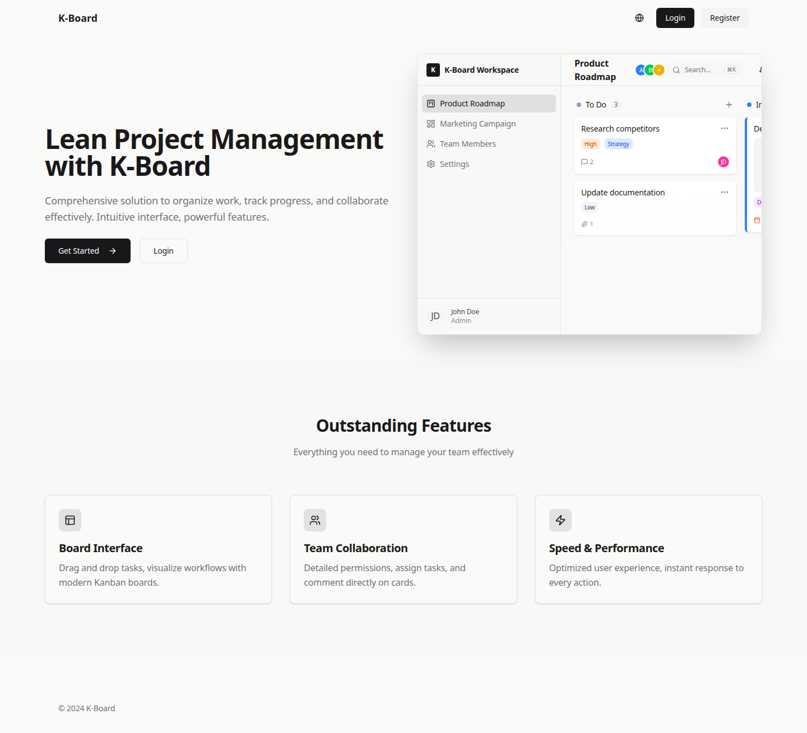
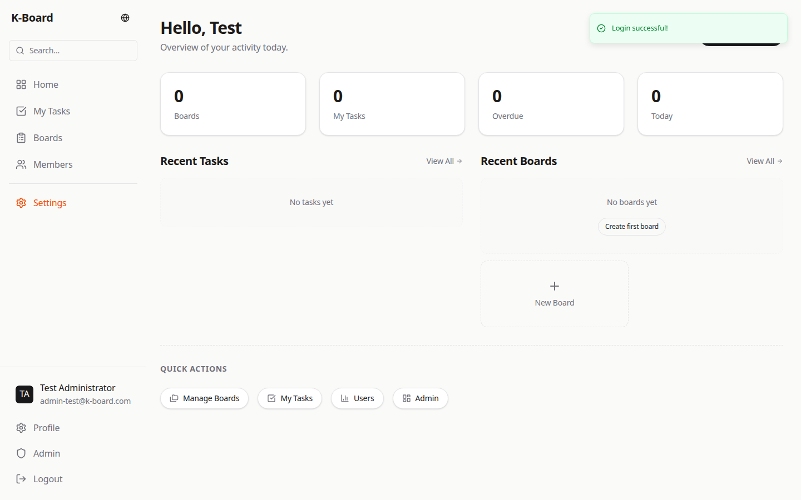
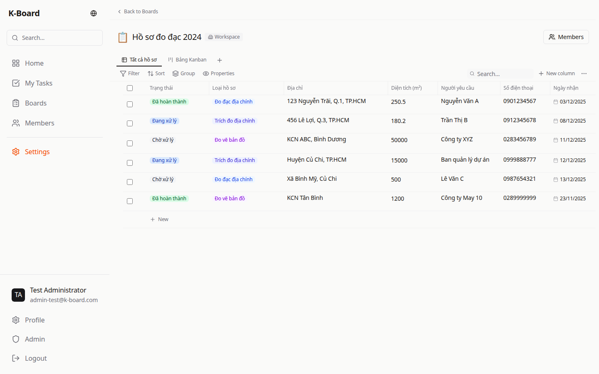
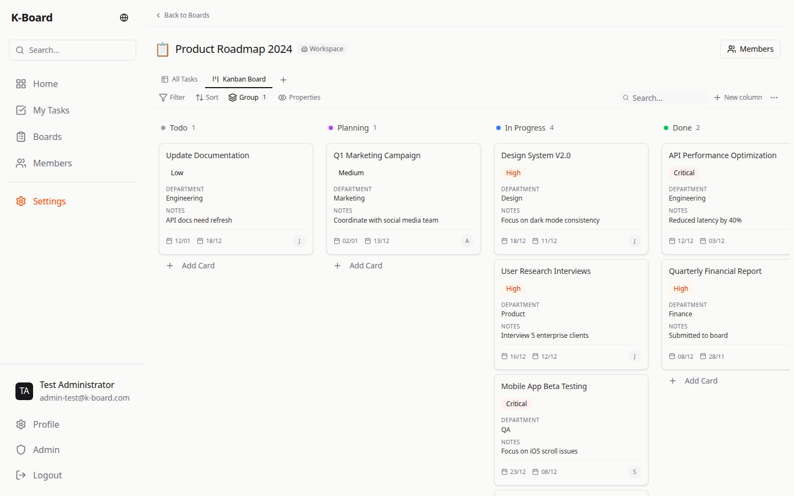
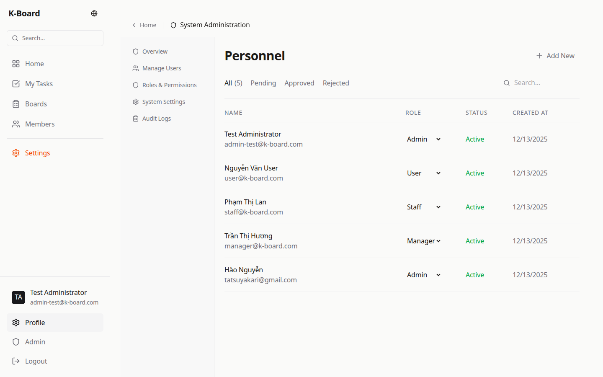
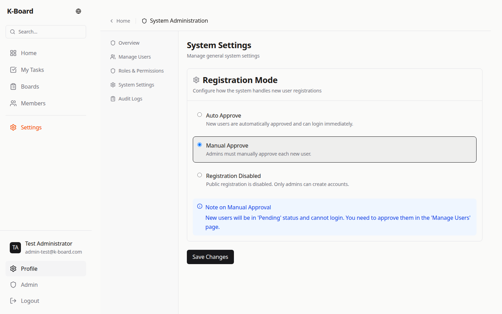
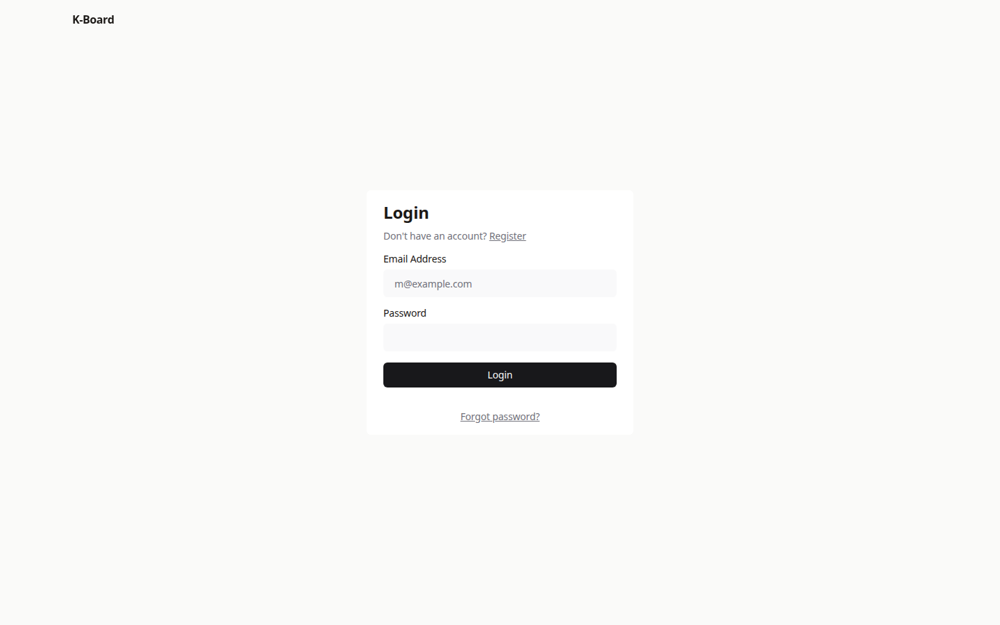
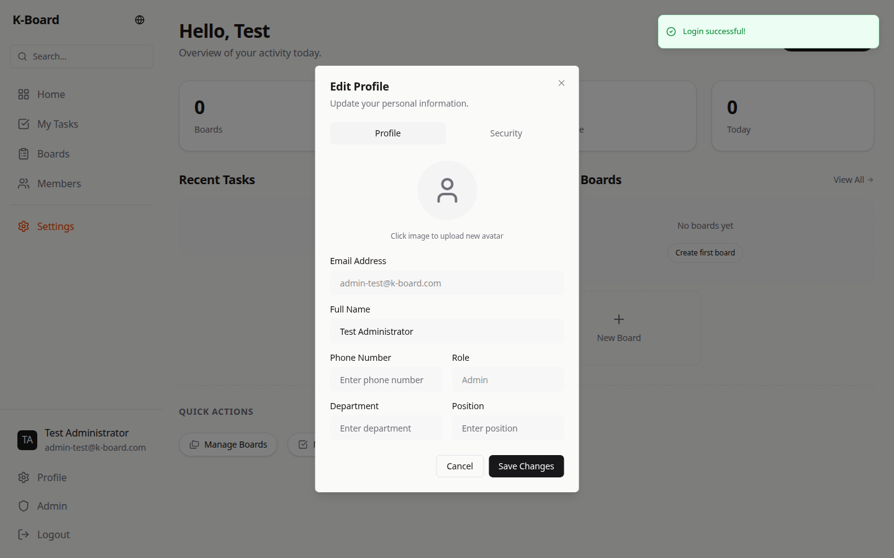

<div align="center">
  <h1>K-Board</h1>
  <h3>The Open Source, Notion-Inspired Task Management System</h3>

  <p>
    Enterprise-grade project management with dynamic Kanban boards, powerful RBAC, <br/>
    and a beautiful, modern user interface.
  </p>

  <p>
    <a href="#-quick-deployment"><strong>🚀 Quick Deploy</strong></a> ·
    <a href="#-features"><strong>✨ Features</strong></a> ·
    <a href="#-gallery"><strong>📸 Gallery</strong></a> ·
    <a href="#-tech-stack"><strong>🛠️ Tech Stack</strong></a>
  </p>

  <p>
    
    
    
    
    
    
  </p>

  <br />

  
</div>

<br />

## 📖 Introduction

**K-Board** is a modern, high-performance task management ecosystem designed for teams who need the flexibility of Notion with the structure of strict project management tools. Built on the bleeding edge of the React ecosystem (Next.js 16, React 19, RSC), it delivers a snappy, app-like experience.

Whether you are a startup needing a roadmap tool or an enterprise requiring strict role-based access control (RBAC), K-Board scales with your needs.

## 🚀 Quick Deployment

Deploy K-Board in seconds on any Linux server (Ubuntu/Debian/CentOS) with Docker installed.

### ⚡ One-Line Automated Install

```bash
curl -sSL https://raw.githubusercontent.com/tatsuyakari1203/k-board/main/install.sh | bash
```

> This script creates a secure `docker-compose.yml`, generates random secrets, pulls the latest optimized image, and sorts everything for you.

### 🐳 Manual Docker Compose

<details>
<summary>Click to view manual setup instructions</summary>

```bash
# 1. Pull the image
docker pull tatsuyakari/k-board:latest

# 2. Run with environment variables
docker run -d -p 3000:3000 \
  --name k-board \
  -e MONGODB_URI=mongodb://host.docker.internal:27017/k-board \
  -e AUTH_SECRET=change_this_to_a_secure_random_string \
  -e AUTH_URL=http://localhost:3000 \
  tatsuyakari/k-board:latest
```

</details>

---

## 📸 Gallery

<div align="center">
  <h3>Interactive Dashboard (Light/Dark Mode)</h3>
  
</div>

### 📊 Versatile Views

Compare our powerful visualization modes. Switch instantly between high-level roadmaps and detailed data entry.

|                                   **Table View** (Excel-like Editing)                                    |                                     **Kanban View** (Drag & Drop)                                     |
| :------------------------------------------------------------------------------------------------------: | :---------------------------------------------------------------------------------------------------: |
|  |  |

<details>
<summary><strong>🔎 View More Screenshots (Admin, Profile, Login)</strong></summary>

|                                     Admin Users                                     |                                     Admin Settings                                     |
| :---------------------------------------------------------------------------------: | :------------------------------------------------------------------------------------: |
|  |  |

|                             Login Page                              |                                  User Profile                                  |
| :-----------------------------------------------------------------: | :----------------------------------------------------------------------------: |
|  |  |

</details>

---

## ✨ Features

### 🛠️ Core Productivity

- **Dynamic Kanban**: Fully draggable tasks and columns with optimistic UI updates.
- **Advanced Properties**: 12+ types including Status, Priority (Select), Date, User, Rich Text, and creating custom properties on the fly.
- **Views System**: Save multiple views (Kanban, Table) with unique filters and sorts per board.
- **Real-time Filters**: Boolean logic filtering (AND/OR) for complex queries.

### 🏢 Enterprise & Security

- **RBAC System**: Granular permissions (Owner, Admin, Editor, Viewer, Restricted).
- **Organization Management**: User approval flows, deactivation, and invite management.
- **Audit Ready**: Strict database validation ensuring no "ghost" sessions or unauthorized access.

### 🎨 Design & Experience

- **Modern UI**: Built with Shadcn UI & Radix Primitives for accessibility.
- **Theming**: First-class Dark Mode support.
- **Internationalization (i18n)**: English and Vietnamese support out of the box.

---

## 🛠️ Tech Stack

Built with the latest Modern Web technologies for performance and longevity.

| Layer        | Tools                                             |
| ------------ | ------------------------------------------------- |
| **Frontend** | Next.js 16 (App Router), React 19, TypeScript 5.7 |
| **Styling**  | Tailwind CSS 4.0 (Alpha), Shadcn UI, Lucid React  |
| **State**    | Zustand, TanStack Query v5                        |
| **Backend**  | NextAuth v5 (Beta), Server Actions                |
| **Database** | MongoDB 7.0, Mongoose 9.0                         |
| **Testing**  | Vitest, Playwright (E2E)                          |

---

## 💻 Local Development

1. **Clone & Install**

   ```bash
   git clone https://github.com/tatsuyakari1203/k-board.git
   cd k-board
   pnpm install
   ```

2. **Environment Setup**

   ```bash
   cp .env.example .env.local
   # Check .env.local for MONGODB_URI
   ```

3. **Database Seed (Important)**

   ```bash
   pnpm seed
   ```

   > Populates the DB with "Product Roadmap" and default users.

4. **Run Dev Server**
   ```bash
   pnpm dev
   ```

### 🔐 Default Accounts (Local/Seed)

- **Admin**: `admin@k-board.com` / `admin123456`
- **Manager**: `manager@k-board.com` / `123456`
- **Staff**: `staff@k-board.com` / `123456`

---

## 🤝 Contributing

We welcome contributions! Please check the `docs/` folder for architectural plans:

- [Kanban Architecture](./docs/KANBAN-VIEW-PLAN.md)
- [Permission System](./docs/USER_ROLE_PERMISSION_PLAN.md)

## 📄 License

Licensed under the [MIT License](./LICENSE).

<br />
<div align="center">
  <sub>Built with ❤️ by the Open Source Community</sub>
</div>
